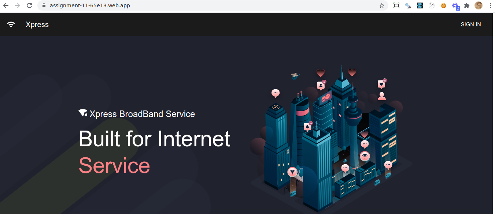

<div align="center">
  

# Xpress - A MERN stack web app

An isp based web app where you can order your favourite package!

<br/>


✨ _Loved the project? Give this project a star to show your support._ ✨


   
</div>

---

## 🧐 Feature list

- [x] explore favourite service
- [x] login with google
- [x] order service
- [x] manage orders, service as admin
- [x] give review as a user
- [x] image upload using imagebb api


## 🚀 Getting started

This project is deployed at https://assignment-11-65e13.web.app/

Guide for local deployment -

1. Clone the repository

```bash
https://github.com/Porgramming-Hero-web-course/complete-website-client-ashiqdev
```

2. Install dependencies

```bash
yarn
```


3. Run app

```bash
yarn start
```

4. Open project at http://localhost:3000


## ❤️ Support

If you happen to love this project, leave a star on the repo. That'll keep me motivated. Let me know your thoughts with a tweet. Mention me [@ashikduit](https://twitter.com/ashikduit).

Thanks!

Contributions are welcomed!

<div align="center">
Developed with ❤️ in Bangladesh
</div>
